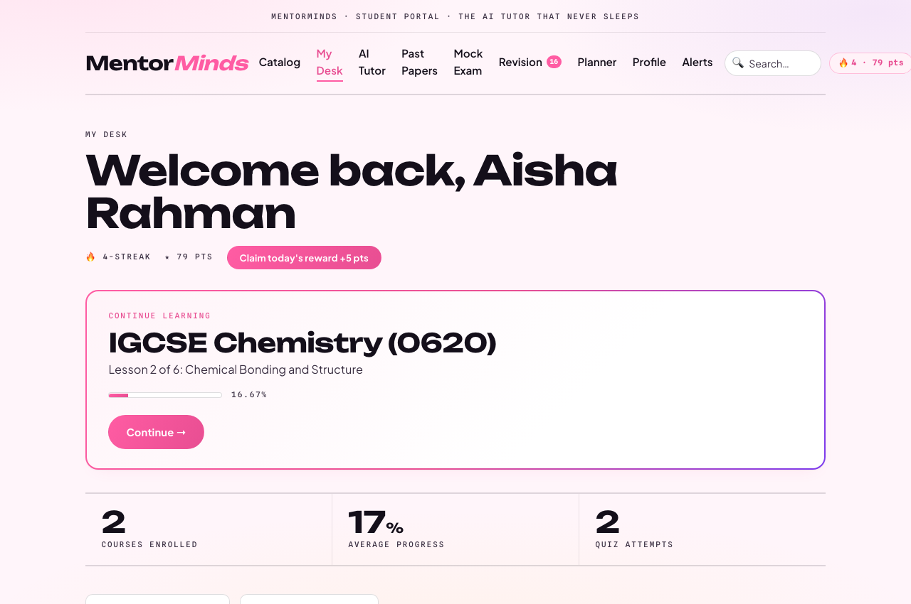
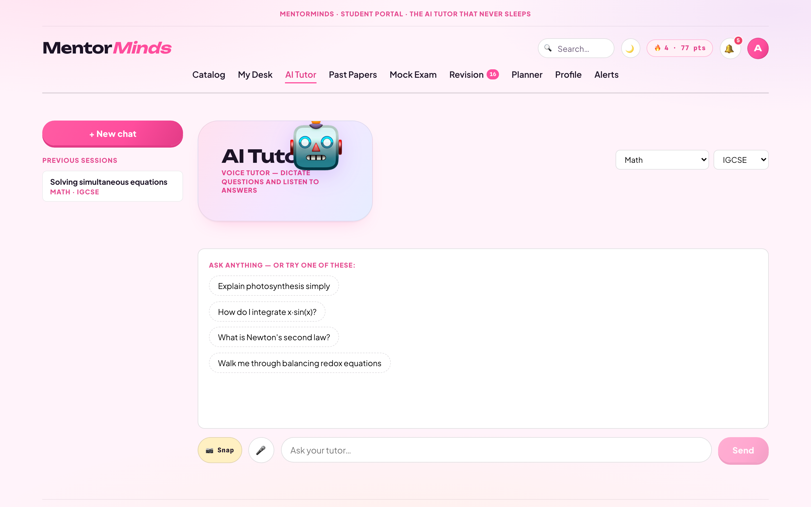
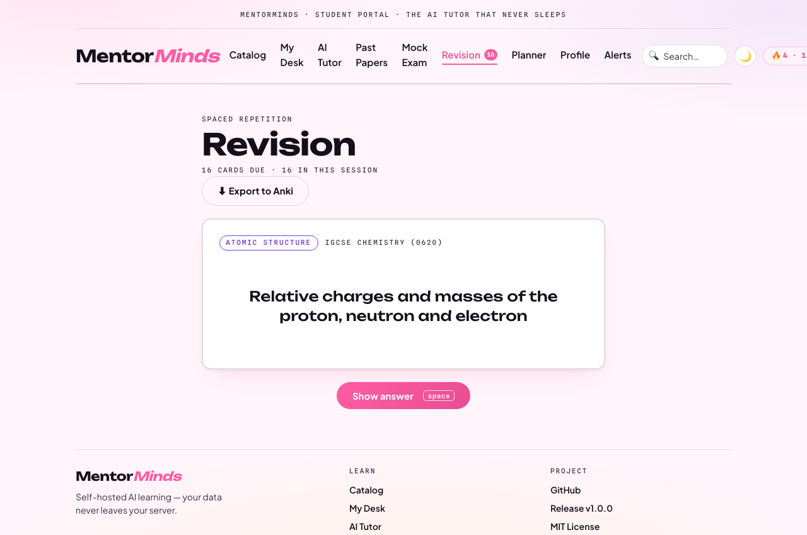
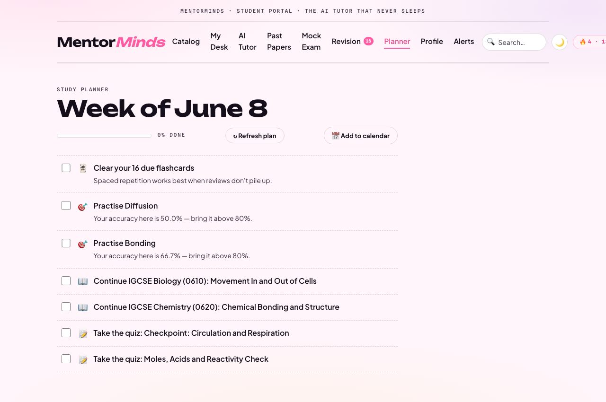
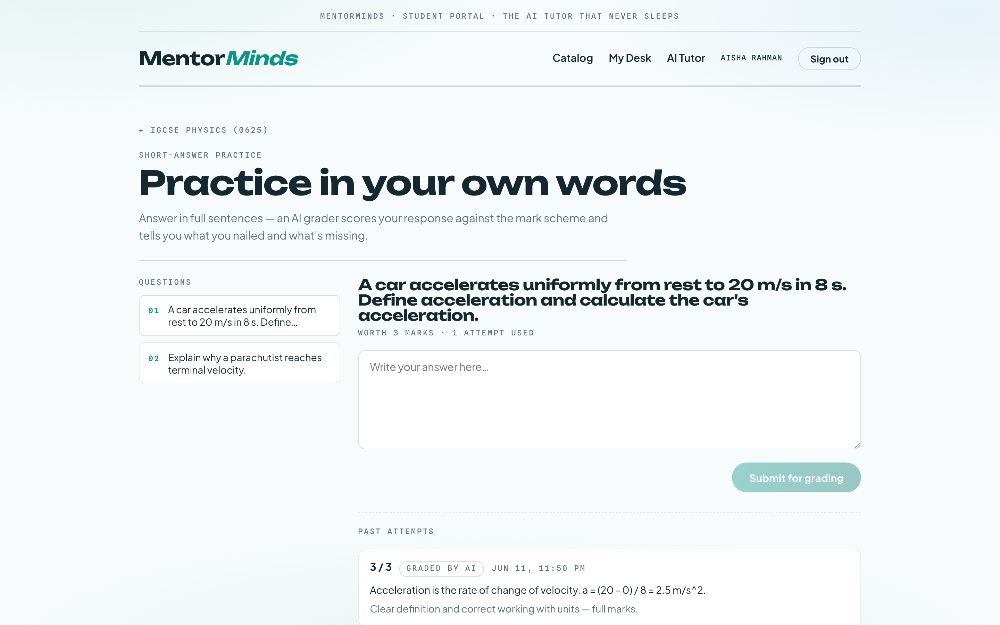
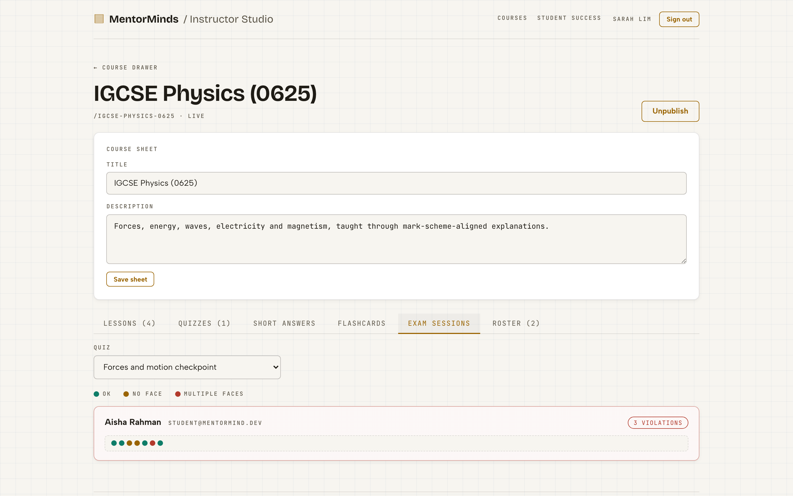
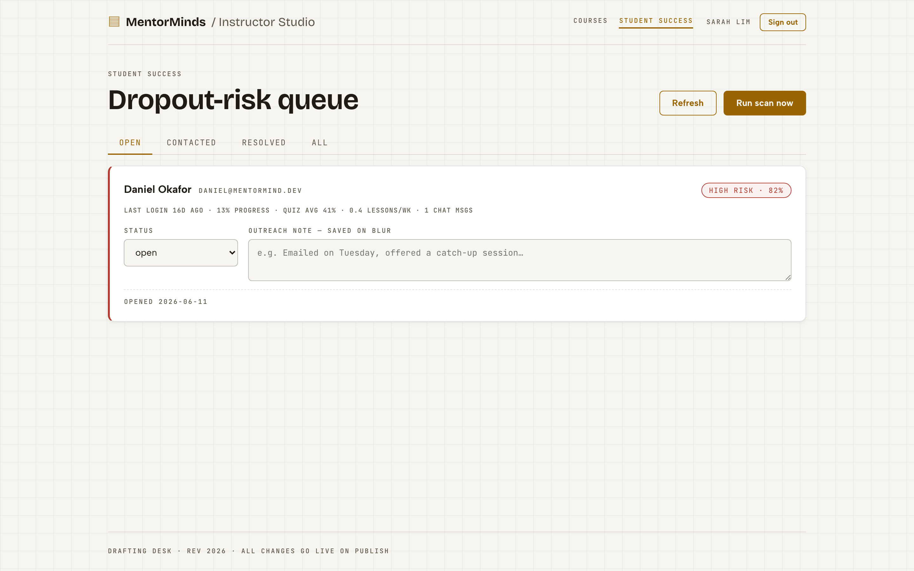
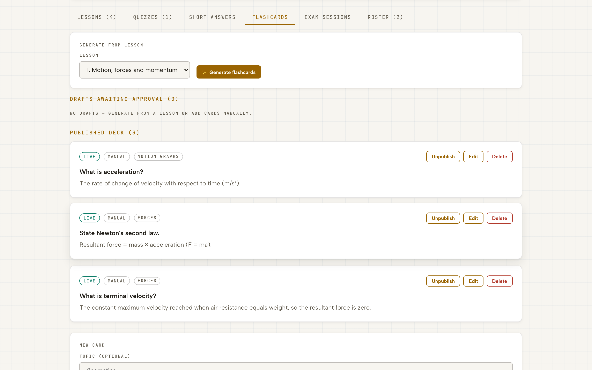
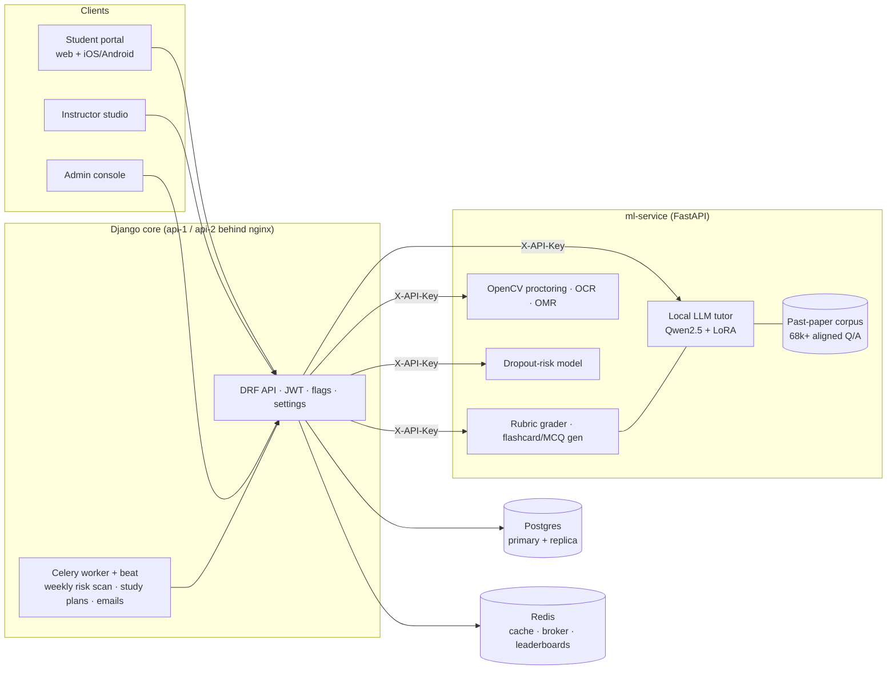

<div align="center">

# 🧠 MentorMind

**The fully self-hosted AI learning platform.**
An AI tutor fine-tuned on real Cambridge past papers, rubric-graded answers,
spaced repetition, adaptive practice, exam proctoring and dropout prediction —
**your students' data never leaves your server. Zero third-party AI APIs.**

[](https://github.com/Arnobrizwan/mentormind/actions/workflows/ci.yml)
[](LICENSE)
[](#-try-it-in-2-minutes)
[](CONTRIBUTING.md)

**[🎓 Live demo (student)](https://mentormind-demo.vercel.app) ·
[🧑‍🏫 Live demo (instructor studio)](https://mentormind-studio.vercel.app) ·
[📱 Android APK](https://github.com/Arnobrizwan/mentormind/releases/latest)**

**$0 stack:** Vercel + Render + Hugging Face Spaces — no paid AI APIs. See [docs/FREE-DEMO-STACK.md](docs/FREE-DEMO-STACK.md).

<samp>
<a href="#-try-it-in-2-minutes">Quick start</a> ·
<a href="#ai-learning-features">Features</a> ·
<a href="#how-it-compares">Why MentorMind</a> ·
<a href="#architecture">Architecture</a> ·
<a href="#self-hosted-on-your-own-vps-always-warm-no-cold-starts">Self-host</a> ·
<a href="#faq">FAQ</a>
</samp>

The demo resets itself periodically, and **the AI tutor is live**
(real attributed Cambridge mark-scheme answers, served from a private 68k-question corpus).

</div>

<details>
<summary><b>🚀 What's new in DIGITEX v2</b> — 17 updates (click to expand)</summary>

| | Update |
|---|---|
| 🌐 | **Full student-portal i18n** — English + Bahasa Malaysia across every student page |
| 📲 | **PWA install** — adds to the home screen at booth displays |
| 🔎 | **Smart Vector RAG tutor** — MiniLM embeddings + cosine match, token-overlap fallback |
| 💬 | **Conversational memory** — tutor session history flows into the model pipeline |
| ⏰ | **Scheduled sweeps** — risk scans + planner rebuilds via GitHub Actions cron (no paid beat) |
| 🔑 | **Self-service password reset** across all 3 portals |
| 🎯 | **Predicted grades** — Cambridge A*–U bands on dashboard, roster, and gradebook |
| 📊 | **Item analysis** — per-question difficulty, discrimination, distractor counts |
| 📤 | **Gradebook CSV export** — whole-class scores, marks, readiness + predicted grade |
| 👨‍👩‍👧 | **Guardian progress links** — revocable, read-only, PII-light, no account |
| ✍️ | **Handwritten-answer OCR** in practice — snap a written answer, OCR fills the box |
| ➗ | **KaTeX math** in tutor answers, lessons, past papers, and mock exams |
| 👍 | **Tutor feedback flywheel** — rate/flag answers; instructors triage in a Studio surface |
| 🔥 | **Daily goal** — Duolingo-style points goal + progress ring, tunable live |
| 📅 | **Planner `.ics` export** — subscribe to your weekly plan in Google/Apple/Outlook |
| 🃏 | **Revision → Anki/CSV export** — take your spaced-repetition deck offline |
| 🔔 | **PWA web-push reminders** — opt-in "cards due / keep your streak", self-hosted VAPID |

</details>

## ✨ See it

<div align="center">


</div>

| Student dashboard | AI tutor (grounded in mark schemes) |
|---|---|
|  |  |

| Spaced-repetition revision | Weekly study plan |
|---|---|
|  |  |

| AI short-answer grading | Proctoring timeline (instructor) |
|---|---|
|  |  |

| Student Success (dropout remediation) | Flashcard review queue (instructor) |
|---|---|
|  |  |

## 🚀 Try it in 2 minutes

```bash
git clone https://github.com/Arnobrizwan/mentormind && cd mentormind

# Backend (Python 3.14)
cd backend && python3.14 -m venv .venv && .venv/bin/pip install -r requirements.txt
DEBUG=1 .venv/bin/python manage.py migrate
DEBUG=1 .venv/bin/python manage.py seed_demo     # demo courses, students, AI features
DEBUG=1 .venv/bin/python manage.py runserver

# Frontend (Node ≥ 24.15)
cd ../frontend && npm ci && npx ng serve student-portal   # http://localhost:4200
```

| Account | Email | Password |
|---|---|---|
| 🎓 Student | `student@mentormind.dev` | `mentormind123` |
| 🧑‍🏫 Instructor | `instructor@mentormind.dev` (use `ng serve instructor-studio`, :4201) | `mentormind123` |
| ⚙️ Admin | `admin@mentormind.dev` (`ng serve admin-console`, :4202) | `mentormind123` |

The tutor works out of the box (retrieval + a deterministic stub). For real
mark-scheme answers, start the ml-service too — the hosted demo runs it on a
free Hugging Face Space with the corpus in a private dataset. See
[the model pipeline](#the-tutor-model-pipeline-fully-self-hosted).

Or deploy your own free demo API in one click:

[](https://render.com/deploy?repo=https://github.com/Arnobrizwan/mentormind)

## Why self-hosted AI?

Most EdTech ships student questions, answers, and behavioral data to OpenAI or
similar. MentorMind doesn't: the tutor is a **LoRA fine-tune of
Qwen2.5-0.5B running in-process** (Apple-Silicon MPS, CUDA, or CPU), grounded
by retrieval over 68k+ aligned past-paper questions where a strong match
returns the **official mark scheme**, attributed. Grading, flashcard and quiz
generation run through the same local model — and every AI feature has an
offline heuristic fallback, so nothing breaks with no model loaded.

## How it compares

|  | Typical AI EdTech SaaS | **MentorMind** |
|---|---|---|
| Where student data goes | OpenAI / Anthropic / vendor cloud | **Your server. Full stop.** |
| Per-question AI cost | API tokens, forever | **$0 — local 0.5B model on CPU/MPS/CUDA** |
| Answer trustworthiness | Model's best guess | **Official mark schemes first, attributed; LLM only as grounded fallback** |
| AI-generated content | Pushed straight to students | **Instructor approves every draft (flashcards, quizzes)** |
| When the model is down | Feature breaks | **Heuristic fallbacks keep every feature working** |
| Acting on analytics | Dashboards you have to watch | **Agentic loops: weekly plans, nudges, human-escalation tickets** |

## Architecture



## Stack

| Layer | Tech |
|---|---|
| Backend | Django 6 + DRF + Celery (worker + beat) + SimpleJWT (Python 3.14) |
| Frontend | Angular (latest, signals + standalone) — `student-portal` (:4200), `instructor-studio` (:4201), `admin-console` (:4202), `shared` lib |
| Mobile | Capacitor (iOS + Android) wrapping the student portal — same codebase, native camera/mic |
| Design | Hand-rolled poster-branded design system (warm pink surfaces, magenta accents) — 3D flashcard flips, count-up stats, staggered entrances, skeleton loaders, celebration micro-moments, PWA manifest; all `prefers-reduced-motion` safe |
| ML service | FastAPI + PyTorch (MPS/CUDA/CPU) + transformers/peft + OpenCV (Python 3.13) |
| Tutor model | Qwen2.5-0.5B-Instruct + LoRA adapter fine-tuned on aligned Cambridge past papers, served in-process |
| Data | PostgreSQL primary + read replica, Redis, SQLite (past-paper corpus) |
| Infra | Docker Compose → Kubernetes (kustomize), nginx LB, GitHub Actions CI |
| Observability | Prometheus, Grafana, django-prometheus + prometheus-fastapi-instrumentator `/metrics` |

## AI learning features

All model output that reaches students is either grounded in official mark
schemes or reviewed by an instructor first. Every LLM feature has an offline
heuristic fallback, so nothing 503s when no model is loaded.

| Feature | How it works |
|---|---|
| 🤖 **AI tutor** | Retrieval-first over 68k+ aligned past-paper questions (strong match returns the *official mark scheme*, attributed); weak/no match falls to the fine-tuned local LLM with retrieved grounding. Daily quota, premium unlimited, thumbs feedback. |
| 📷 **Multimodal tutoring** | Photograph a textbook question — OCR'd by the ml-service, answered like typed text. |
| 🎤 **Voice tutoring** | Dictate questions (SpeechRecognition) and have answers read aloud (speechSynthesis); feature-detected. |
| 📝 **Short-answer grading** | Free-text answers graded against instructor mark schemes — LLM emits a structured criteria breakdown (met ✓ / missing ✗ + feedback); criterion-recall heuristic fallback. Attempt caps, mark scheme never exposed to students. |
| 🃏 **Spaced repetition** | SM-2 flashcard queue. AI drafts cards from lesson content; drafts are unpublished until the instructor approves. Reviews feed the points/streak system (farming-proof: only due cards grade). |
| 🎯 **Adaptive practice** | Per-question results + topic tags → weak-topic accuracy stats → "Focus areas" feed recommending exactly what to practise next. |
| 📋 **Agentic study planner** | Weekly Celery sweep builds each student a plan (due cards, weak topics, next lessons, unattempted quizzes), nudges them, and **escalates**: two slipping weeks open a remediation ticket for a human. |
| ✨ **AI quiz drafting** | Instructors generate MCQ drafts from a lesson; questions are edited and confirmed before anything is saved — never auto-published. |
| 🚨 **Exam proctoring** | Webcam frames every 12s during quizzes → face-count verdicts (never images) → instructor timeline; edge-triggered alert after 3 consecutive flagged frames. |
| 📈 **Dropout-risk remediation** | Weekly scan scores every student (logistic model served by ml-service); high risk → encouragement nudge + ticket in the instructor "Student Success" queue (scoped per-instructor, single-flight scans). |
| 🎓 **Exam readiness** | 0–100 blend of progress, quiz average, practice volume, accuracy (weights live-tunable). Rings on the student dashboard, weakest-first column on the instructor roster. |
| ⏱ **Timed quizzes** | Instructors set per-quiz time limits; students get a countdown with auto-submit — real exam practice. |
| 🔍 **Quiz review** | Per-question ✓/✗ breakdown after every attempt (never revealing the key), with weak-topic callouts feeding adaptive practice. |
| 📜 **Past-paper practice** | Browse 68k+ real Cambridge questions by subject; attempt, then reveal the official mark scheme. |
| ⏰ **Mock exams** | Timed papers sampled from the corpus with self-marking against official schemes. |
| 📊 **Class insights** | Instructors see per-topic class accuracy ("teach next" callouts) from real attempt data. |
| 📬 **Weekly digest** | Sunday email/notification: points, streak, due cards, weakest topic. |
| 🎓 **Certificates** | Print-ready, shareable completion certificates (localized EN/BM) unlocked at 100% course progress. |
| 🏅 **Gamification** | Points ledger, streaks (with a GitHub-style activity heatmap), badges (DB-defined rules), weekly leaderboard, daily login rewards. |

## The tutor model pipeline (fully self-hosted)

```
Cambridge PDFs ─► OCR + QP/MS alignment (pastpapers pipeline) ─► aligned corpus (68k+ Q/A)
       ─► scripts/train_tutor.py (LoRA fine-tune, runs on Apple-Silicon MPS)
       ─► models/tutor-lora ─► served in-process (LOCAL_LLM=1) or via any
          OpenAI-compatible server (CUSTOM_LLM_URL: vLLM / llama.cpp / Ollama)
```

**Evaluation gate** (Self-Harness style, arXiv:2606.09498): before/after any
prompt or threshold change, run

```bash
cd ml-service && .venv/bin/python scripts/eval_tutor.py --max 40
```

— deterministic held-in/held-out splits, leave-one-out answering, mark-scheme
token recall. Accept a change only if held-in improves without held-out
degrading. Mine real failure clusters from student feedback with
`python manage.py mine_tutor_failures`.

## Dynamic-first, no hardcode

- `settings_engine` — every site setting is a DB row, Redis-cached, invalidated on save;
  all Angular apps bootstrap branding from `/api/v1/settings/public/`
- `flags` — feature flags toggle whole modules live (chat, recommendations, ai_tutor,
  short_answer_grading, flashcard_generation, quiz_generation, proctoring…; the ML
  service polls `/api/v1/flags/` and fails open)
- Tunable without redeploys: quotas, attempt caps, readiness weights, retrieval
  thresholds, points values, scan schedules — env vars or SiteSettings

## Adding the ML service (real LLM answers)

```bash
# Python 3.13 — .env enables the local LLM tutor
cd ml-service
python3.13 -m venv .venv && .venv/bin/pip install -r requirements.txt
# .env: LOCAL_LLM=1, LOCAL_LLM_BASE=Qwen/Qwen2.5-0.5B-Instruct (adapter
# defaults to models/tutor-lora). Needs torch/transformers/peft for LLM mode.
.venv/bin/uvicorn app.main:app --port 9000
```

Point Django at it with `ML_SERVICE_URL=http://localhost:9000`,
`TUTOR_MODEL_URL=http://localhost:9000/v1/tutor/answer` and a shared `ML_API_KEY`.
Swagger UI for the backend lives at `http://127.0.0.1:8000/api/docs/`.

### Answering any question (free models)

A strong corpus match always returns the real mark scheme. When a question has
**no** match, the tutor falls back to the configured model and answers it as a
general study tutor — so students can ask anything relevant, not just
corpus-covered questions. Off-corpus answers need a model; pick one (all free):

- **Local Gemma (still fully offline, no API):** `LOCAL_LLM=1` +
  `LOCAL_LLM_BASE=google/gemma-2-2b-it` (≈5 GB RAM). Bigger and far better at
  general questions than the tiny Qwen-0.5B default.
- **Local Ollama:** `ollama run gemma2` → `CUSTOM_LLM_URL=http://localhost:11434/v1`,
  `CUSTOM_LLM_MODEL=gemma2`.
- **Free hosted gateway** (opt-in — data leaves your server): set
  `CUSTOM_LLM_URL` + `CUSTOM_LLM_API_KEY` for Groq (`gemma2-9b-it`), OpenRouter
  (`google/gemma-2-9b-it:free`), or Google AI Studio. See `ml-service/.env.example`.

With no model configured the tutor stays corpus-only — it just answers fewer
off-syllabus questions. Strong matches are always mark-scheme-grounded
regardless of model.

## Mobile app (Capacitor)

The student portal ships as a native iOS/Android app — same code, every feature,
with native camera (proctoring, photo questions) and microphone (dictation)
permissions wired up.

```bash
cd frontend
MM_API_BASE_URL=https://api.your-host npm run build:mobile   # build + inject API origin + cap sync
npm run run:android    # or run:ios / open:android / open:ios
```

**DIGITEX / public demo APK** (student portal → Render API, login baked in via
`seed_demo`):

```bash
cd frontend
npm run apk:demo    # → ../docs/releases/mentormind-demo.apk
```

Android builds need **Node ≥ 24.15**, **JDK 21** (not JDK 26 — AGP rejects it),
and `ANDROID_HOME` set. The demo script auto-detects Homebrew `openjdk@21` on macOS.
After changing `CORS_ALLOWED_ORIGINS` in `render.yaml`, redeploy the API so the
APK’s `https://localhost` origin is allowed.

**Student portal extras:** Bahasa Malaysia UI toggle (Profile → Language), a
service worker for offline shell + catalog cache, Capacitor native camera for
Snap & Solve, and Playwright smoke tests (`cd frontend && npm run test:e2e`).

## Full architecture demo (Docker)

```bash
cd infra && docker compose up --build
curl -i http://localhost:8080/api/v1/health/   # repeat: X-Served-By alternates api-1/api-2
```

## Self-hosted on your own VPS (always-warm, no cold starts)

The free Render demo sleeps and cold-starts (~90 s) when idle. For a
persistent, always-on install, [`deploy/`](deploy/) ships a single-box
`docker compose` stack — Django + Celery worker + the in-process tutor
(`ml-service`) + Postgres + Redis — behind **Caddy** with automatic HTTPS.
The three Angular frontends stay free on Vercel; only the API lives on the box.

```bash
git clone https://github.com/Arnobrizwan/mentormind && cd mentormind/deploy
cp .env.example .env      # set API_DOMAIN, secrets, CORS origins, HF token
docker compose up -d --build
```

Runs comfortably on an 8 GB VPS (~$5–12/mo). Full walkthrough — DNS, secrets,
seeding, backups, memory budget — in [`deploy/README.md`](deploy/README.md).

## Quality: measured, not promised

- **200 automated tests + a real E2E journey** — 129 backend (Django) and
  71 ml-service (pytest, hermetic: the suite never loads the real model),
  plus Playwright specs that run the full login → enroll → quiz → tutor
  journey against a seeded backend — all on every push, alongside ruff and
  the Angular builds.
- **A real evaluation harness for the AI** (`scripts/eval_tutor.py`): the
  tutor is scored against held-out past-paper questions by mark-scheme token
  recall, leave-one-out (a question can never retrieve itself). Prompt or
  threshold changes are accepted only if held-in improves *without held-out
  degrading*. Current retrieval-only baseline: **0.39 / 0.49 recall**
  (held-in / held-out) — published here so improvements are honest.
- **Failure mining from real usage**: `manage.py mine_tutor_failures`
  clusters thumbs-down tutor replies by subject so the weakest areas get
  fixed first.
- **Adversarially reviewed**: the feature set went through a multi-agent
  security/correctness review (permission isolation, race conditions,
  points-farming, API contracts) — 23 confirmed findings, all fixed with
  regression tests.

## FAQ

<details>
<summary><b>Can I use my own past papers / other subjects?</b></summary>

Yes — drop PDFs into the pipeline (`POST /api/pipeline/discover` →
`process-next`); it OCRs, aligns question papers with mark schemes, and the
corpus grows. The fine-tune script trains on whatever the pipeline produced.
</details>

<details>
<summary><b>Do I need a GPU?</b></summary>

No. The 0.5B model runs on CPU; Apple-Silicon (MPS) and CUDA are used when
available. Or point `CUSTOM_LLM_URL` at any OpenAI-compatible server
(vLLM, llama.cpp, Ollama) and host whatever model you like.
</details>

<details>
<summary><b>Can the tutor answer questions outside the past papers?</b></summary>

Yes — on a strong corpus match it returns the official mark scheme; otherwise
it falls back to your configured model and answers as a general study tutor.
Plug in **Gemma** locally (`LOCAL_LLM_BASE=google/gemma-2-2b-it`) or a free
hosted gateway (Groq / OpenRouter / Google AI Studio) via `CUSTOM_LLM_URL`.
With no model set, it stays corpus-only. See
[Answering any question](#answering-any-question-free-models).
</details>

<details>
<summary><b>What happens if the model gives a bad answer?</b></summary>

Strong matches never touch the model — students get the official mark scheme,
attributed. Generated answers are grounded with retrieved mark schemes, carry
thumbs feedback (flagged answers land in an instructor review surface), and
AI-drafted content (quizzes, flashcards) requires instructor approval before
students ever see it.
</details>

<details>
<summary><b>Is the proctoring storing video of students?</b></summary>

No. Frames are analyzed in memory and discarded; only face-count verdicts
(`ok` / `no_face` / `multiple_faces`) with timestamps are stored.
</details>

<details>
<summary><b>What does it cost to run?</b></summary>

The reference deployment runs on free tiers + one small VM. There are no
per-token costs anywhere.
</details>

## Tests & CI

```bash
cd backend && DEBUG=1 .venv/bin/python manage.py test    # 133 tests
cd ml-service && .venv/bin/pytest                        # 75 tests (hermetic — no model load)
cd frontend && npx ng build student-portal && npx ng build instructor-studio && npx ng build shared
```

GitHub Actions CI runs ruff (backend + ml-service), both Python suites, the
Angular builds, and the Playwright E2E journey (against a seeded backend) on
every push. `ml-train.yml` retrains on demand; `load-test.yml`
runs the k6 scenarios.

## Repo layout

```
backend/      Django project (apps/: accounts, core, tutor, revision, planner,
              engagement, chat, notifications, settings_engine, flags)
frontend/     Angular workspace (3 apps + shared lib) + Capacitor ios/ & android/
ml-service/   FastAPI inference microservice (LLM tutor, grading, generation,
              vision, dropout) + training & evaluation scripts
ml-pipeline/  DVC + MLflow training pipeline (dropout model)
infra/        docker-compose, nginx, prometheus, grafana, k8s (kustomize)
docs/         architecture notes
```

## Roadmap

1. ✅ Foundation — monorepo, Django + Angular + FastAPI skeletons, full Compose infra
2. ✅ Dynamic content engine + core learning — courses/lessons/quizzes/enrollment with cache-aside + invalidation; student portal (catalog, lessons, quizzes, dashboard)
3. ✅ Infra showcase — nginx micro-cache, Redis leaderboard, R2/S3 uploads, Channels websocket chat, notifications with Celery email mirror
4. ✅ ML features — OpenCV proctoring, OMR bubble-sheet grading, Tesseract OCR, co-occurrence recommendations
5. ✅ MLOps — DVC pipeline (prepare→train→evaluate→drift), MLflow registry hooks, GitHub Actions train/deploy with drift gate
6. ✅ Kubernetes manifests (api×2 + HPA, worker, ml-service, ingress), k6 load tests, live system-status board (admin console, staff-only)
7. ✅ Self-hosted AI tutor — past-paper OCR/alignment pipeline, LoRA fine-tune, retrieval-grounded serving, multimodal + voice input
8. ✅ AI assessment & intervention — rubric grading, AI quiz/flashcard drafting with human review, proctoring timelines, dropout remediation loop
9. ✅ Adaptive learning — weak-topic practice, SM-2 spaced repetition, agentic weekly study plans, exam-readiness scoring
10. ✅ Mobile — Capacitor iOS/Android app with native camera/mic

## Contributing & support

PRs welcome — see [CONTRIBUTING.md](CONTRIBUTING.md). The short version:
keep it self-hosted (no third-party AI APIs), gate AI output behind human
review or mark-scheme grounding, and ship tests with features.

If MentorMind is useful to you, **a ⭐ helps more people find it.**

## License

[MIT](LICENSE)
